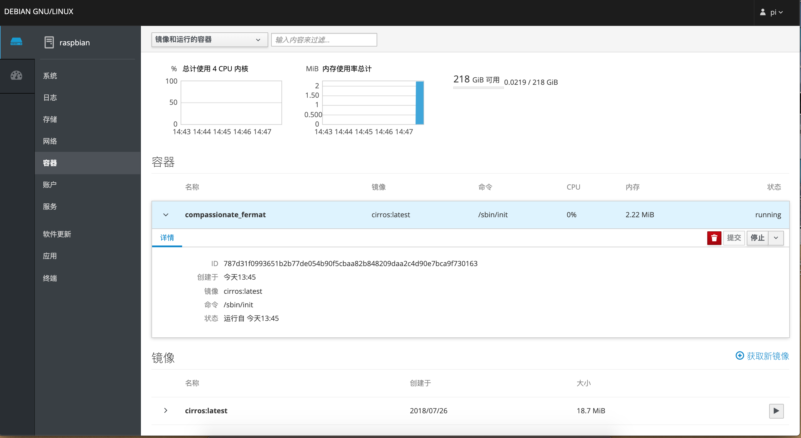
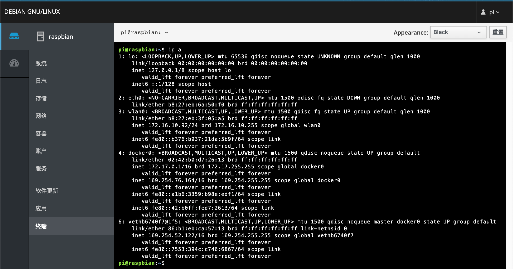
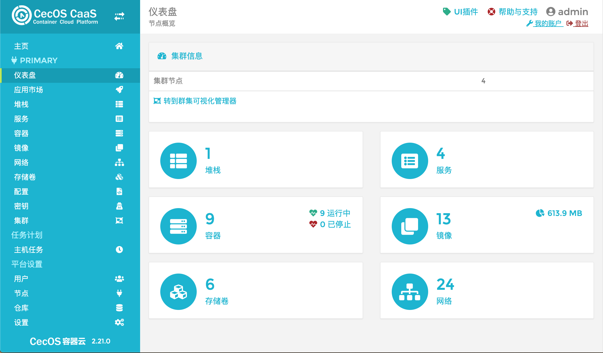
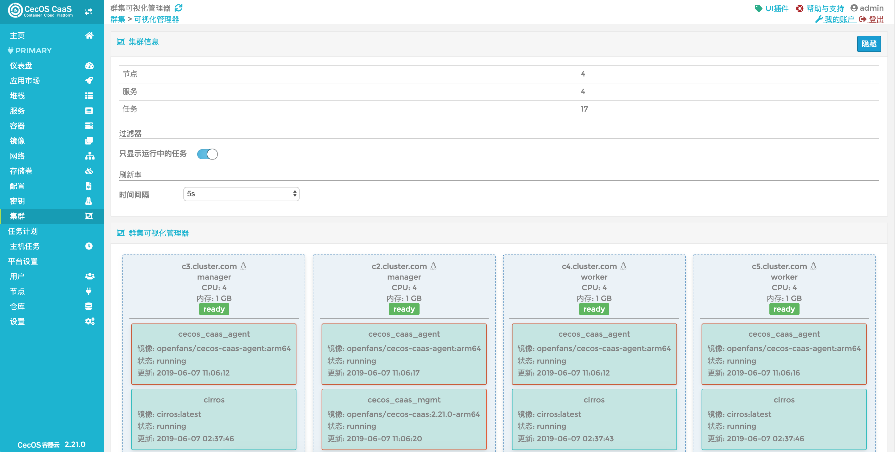
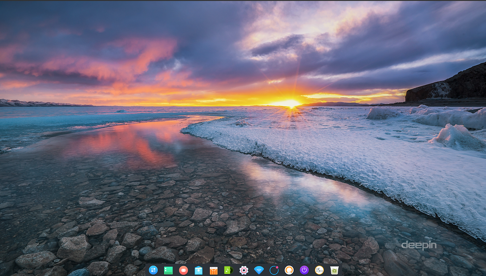
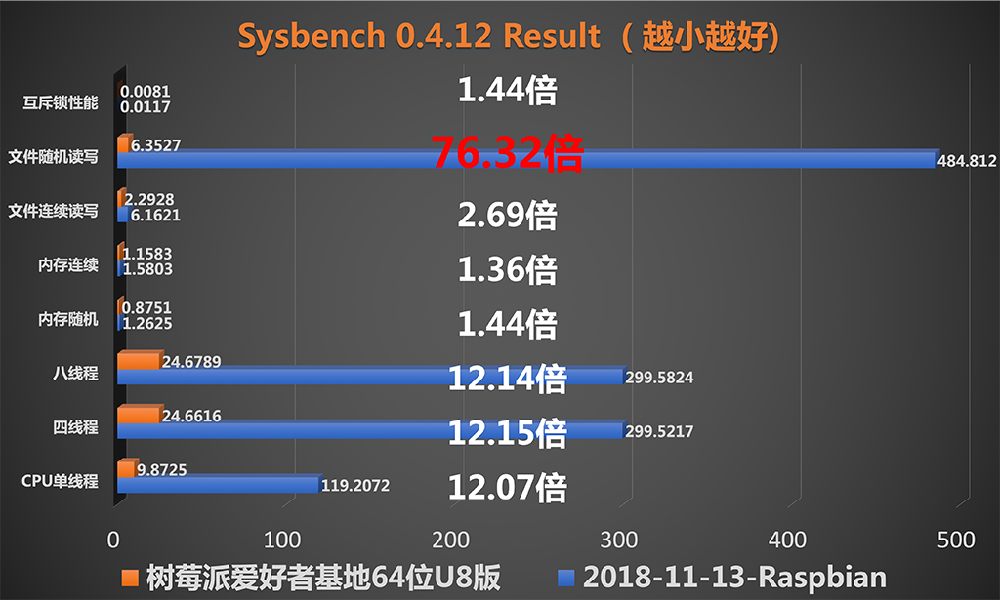
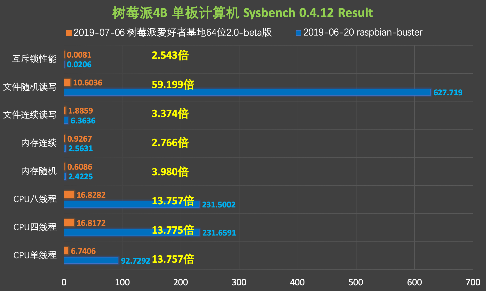
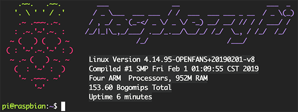

&nbsp;&nbsp;&nbsp;&nbsp;

# ★ 树莓派 4B Debian Pi Aarch 64位系统 2.0 ★

# ★★★★★★ 2019.07.06 - 全球首发 ！！★★★★★★

### PS：Pi 4B [4G版] 4G内存问题我们已修复、显卡3D硬件加速已全线支持 (2.0 RC2以后的版本)，

### 完美适配所有64位硬件版本，现已更新下载，欢迎使用！！！

#### Pi 3B/3B+/3A+/4B 最新 *预览* 版本：2019.08.16 2.0 RC2

#### Pi 3B/3B+/3A+ 最新 *稳定* 版本：2019.07.12 1.0 U10

----

## Debian Pi Aarch64 - 基础系统(WebUI加强版) + 深度桌面 + Xfce桌面

**[OPENFANS开源社区](http://www.openfans.org)&nbsp;&nbsp; && &nbsp;&nbsp;[树莓派爱好者基地](http://www.pifan.org/)&nbsp;&nbsp;荣誉出品**

###  再次重申！我们是团队，企业级的专业团队出品的系统，不要拿个人作品来和我们比较

----

**树莓派64位系统** 1.0/2.0 **：** **Debian Aarch64 基础系统 (WebUI加强版)** + **深度桌面** + **Xfce桌面**













## 系统下载

- **v2.0 预览版**

#### For: **Pi 4B**、3B、3B+、3A+ （支持树莓派全系64位CPU）  - 基于 [Debian Buster]

● **基础** *Aarch64(ARM64)* 系统镜像(无桌面WebUI增强版) 

● **基础** *Aarch64(ARM64)* 系统镜像(无桌面) 

● **Deepin** *Aarch64(ARM64)* 深度桌面系统镜像

● **Xfce** *Aarch64(ARM64)* 桌面系统镜像

以上**2.0**所有系统 **->** 点击 **[此处](https://pan.baidu.com/s/1FKhVQJVW454m8qfrhpmjeQ )** ( 提取码：kayu ) 前往下载

**说明：**

2.0系统无线设置和1.0不太一样，请点击此处 **[网络预配置](./README.md#%E7%BD%91%E7%BB%9C%E9%A2%84%E9%85%8D%E7%BD%AE)** 查看设置方法

- **v1.0 稳定版**

#### For: Pi 3B/3B+/3A+  - 基于 [Debian Stretch]

● **基础** *Aarch64(ARM64)* 系统镜像(无桌面WebUI增强版) 点击 **[此处](https://pan.baidu.com/s/1gC7cdekQFCGVfQaALfX2XQ)**  ( 提取码：bc96 ) 前往下载

● **基础** *Aarch64(ARM64)* 系统镜像(无桌面) 点击 **[此处](https://pan.baidu.com/s/1z6NLcbdPzijEIikovpST7Q)** 前往下载

● **Deepin** *Aarch64(ARM64)* 深度桌面系统镜像 点击 **[此处](./docs/deepin.md)** 前往下载 

● **Xfce** *Aarch64(ARM64)* 桌面系统镜像 点击 **[此处](./docs/xfce.md)** 前往下载 

# [捐赠](donation/README.md)

### FAQ & 常见问题处理

### ★★★★★ Deepin系统 - 特别说明 ★★★★★

**由于 Deepin系统 和上游仓库存在一定的兼容性问题（deepin本身的问题），除非你清楚自己需要做什么，否则强烈建议不要使用以下的任何一条命令进行任何的升级操作！！！**

- 所有的**Deepin**版本系统都需要注意，包括**1.0**和**2.0**的**所有Deepin版本**

- 其他的软件正常安装和使用没有问题

```
apt upgrade
apt-get upgrade
apt dist-upgrade
apt-get dist-upgrade

# 或者其他任何会使得系统进行升级的操作

```

#### 为了更好的了解和使用系统，对于遇见的问题请优先查看一下链接，以免耽误大家时间，谢谢合作！^-^

----

- **时间同步** 

系统默认没有启用时间同步"**ntp服务**", 若要启用"**时间同步**"服务, 请执行以下命令：

```
systemctl enable ntp.service && systemctl start ntp.service 
```

- **更多配置情况请查看** [配置及说明](./README.md#%E9%85%8D%E7%BD%AE%E5%8F%8A%E8%AF%B4%E6%98%8E)

- **更多详细FAQ请查看** [FAQ & 常见问题处理](./README.md#faq-%E5%B8%B8%E8%A7%81%E9%97%AE%E9%A2%98%E5%A4%84%E7%90%86)

----

# 系统介绍

这是为树莓派（Raspberry Pi）**3B/3B+/3A+/4B** 所全新构建的：

**Debian 9 ARM64(Aarch64) 64位系统镜像**

**2.0 基于 [Debian Buster]**

**1.0 基于 [Debian Stretch]**

别问为什么树莓派要用64位系统，64位和32位有什么差别 ？因为树莓派CPU支持64位，但是官方没有，其他的请自行补脑...

## 系统环境

### **●  基础系统**

标准**基础系统镜像**默认没有安装 X-WINDOWS 的桌面环境，但是你可以随意自行安装你喜欢的任何桌面环境

点击 **[此处](./README.md#%E5%AE%89%E8%A3%85%E6%A1%8C%E9%9D%A2)** 查看**安装桌面环境**的示例

### **●  基础系统 Plus++ 版 (WebUI加强版)**

在基础系统之上，加入可视化的WebUI管理界面，默认开启容器支持，真正开箱即用

浏览器使用 **https://你树莓派的IP地址:9090** 访问管理界面

管理界面请使用系统默认账户 **pi** 登录

### **●  深度(Deepin)桌面**

现在，我们基于自己的基础系统镜像，移植了完整的 **【 深度Deepin 15.5 专业版 】** 桌面，目前已发布，并提供下载，这是目前 **第一个** 基于完整的Debian Aarch64架构而构建的适配于树莓派B/3B+/3A的64位 **深度ARM64镜像** ！！

有关 **【 深度Deepin 15.5 ARM64位 专业版 】** 的详细介绍，请前往 **[此处](./docs/deepin.md)** 查看

### **●  Xfce桌面**

同时，我们也发布了 **【 定制优化的 Xfce桌面 】** 的系统镜像，请前往 **[此处](./docs/xfce.md)** 查看相关说明

---

## 系统说明

本文所发布的所有版本是已在企业生产环境下使用并验证的正式版本，系统经过严格测试，完全兼容树莓派 **3B/3B+**（ 3A+ 未测试，因为硬件规格和 3B+ 一致，理论上通用），原生的有线、无线网卡均可正常使用，所有系统软件包数量几乎可以媲美X86的版本，系统基于原生 **Debian 64位** 从头构建（非任何移植版和官改版本），保证原滋原味

由于和原生树莓派没有关系，所以没有树莓派的相关专有命令（如 **raspi-config** ，**rpi-update** 等 ），请自行修改配置文件（ **/boot/config.txt** ）

树莓派天生和Debian的系统兼容性最好（这离不开Raspbian的功劳，因为Raspbian也是基于Debian构建的，所以树莓派在Debian系下的测试是最完善最充分的，再加上本身Debian系统的强大和稳定，大名鼎鼎的Ubuntu就是基于Debian系最出名和成功的一个发行版），加之个人精力有限，之前所发布的Ubuntu、Centos等系统将不再更新，以后只会以本次发布的系统镜像为基线更新，特此说明

本次系统**完全不同**于之前我们所发布的所有系统(同样也包括之前的64位的Debian )，此次我们**全部从头全新构建**在我们的实验室新构建了全新的自动编译和打包、测试系统，同样我们也对系统重新定义了打包流程和调整了所有的相关配置，对内核进行了大量的修改、调整优化和BUG修复，加入了很多新的功能和特性，特别是加入了**KVM虚拟化**的支持以及**重点加强**了对**Docker**的各项特性支持和优化

本次发布的镜像根据不同的文件系统有3个版本，分别为：***Ext4、BtrFS、F2FS***，老铁们可以根据自己的喜好和场景选择不同的版本进行下载和使用

- **考虑到系统的健壮性和稳定，我们推荐使用 Ext4 ！**

- **桌面环境仅提供 Ext4 格式的镜像 ！**

- **无桌面加强版环境目前仅提供 Ext4 格式的镜像 ！**

----

# 64位 2.0新版系统

## 发布说明 **（全球首发！！）**

- 2019年6月20日，树莓派基金会发布了全新的第四代树莓派单板机**4B**，我们在第一时间托人从树莓派官方英国剑桥全球专卖店拿到了4代4G的单板机

- 2019年7月6日，历时半个月的努力，OPENFANS和树莓派爱好者基地联合发布了新的Debian-Pi-Aarch64 2.0系统

- 这是**全球**第一个发行的支持**树莓派4B**的**64位**系统

- 秉承我们**OPENFANS和树莓派爱好者**基地联合发布的**Debian-Pi-Aarch64系统**一直以来的优良传统！

- 系统全面兼容树莓派全线64位CPU的单板机：3B、3B+、3A+、**4B**，并仍然继承1.0稳定版的全部特性

- 系统同频官方基线【debian buster】并已更新至最新版本

- 内核同频上游【长期支持版本】最新版

- 2019年7月24日，Beta2 版本发布

- 2019年08月15日，RC1 版本发布，支持PI4 4G全内存使用

- 2019年08月16日，RC2 版本发布，全系3D加速支持

## 2.0 预览版系统【 已知问题 】说明

(max: 2019.08.15 update)

- **内存问题**

目前内存问题已全部修复，4B所有版本无需修改自动适配识别。

- **无线问题（不影响使用）**

**已确定3B(非3B+)在2.0新版内核下：**

由于上游驱动所致，3B型号的单板机在连接5G模式的Wifi时存在不稳定现在，请连接使用2.4G信号无线，或等待上游及我们更新。

- **GPU 3D加速问题**

**所有系统已全线支持 ！！**

----

#### ReMax PS：

无线、蓝牙均正常，请放心使用

----

## 更新（2.0版本）

#### 最新 *预览* 2.0 版本 | 支持：Pi 3B/3B+/3A+/4B

- **基础系统（增强版）** 现已更新至 **2019-08-16-v2019-2.0-RC2-plus++**

- **基础系统** 现已更新至 **2019-08-16-v2019-2.0-RC2**

- **Deepin深度桌面** *Aarch64(ARM64)* 现已更新至 **2019-08-16-v2019-2.0-RC2**

- **Xfce** *Aarch64(ARM64)* 现已更新至 **2019-08-16-v2019-2.0-RC2**

#### 有关更多更新相关的说明，请点击 [此处](./update.md) 查看

**PS：** 由于架构变动较大，不支持系统从1.0版本升级到2.0。

----

# 更新 (仅限1.0稳定版本)

#### 如何升级和更新系统？ 请点击 [此处](./upgrade.md) 查看

- 请点击 [此处](https://pan.baidu.com/s/1gC7cdekQFCGVfQaALfX2XQ) ( 提取码：bc96 ) 下载最新 **基础系统（增强版）** 镜像

- 请点击 [此处](https://pan.baidu.com/s/1z6NLcbdPzijEIikovpST7Q) 下载最新基础系统镜像

- 请点击 [此处](./upgrade.md)  查看：如何下载更新文件并更新至最新版本

- 请点击 [此处](./qemu-kvm.md) 查看：QEMU虚拟机二进制软件包及虚拟机镜像下载地址和教程

#### **PS：** 由于架构变动较大，不支持系统从1.0版本升级到2.0。

#### 最新 *稳定* 1.0 版本 | 支持：Pi 3B/3B+/3A+

- **基础系统（增强版）** 现已更新至 **2019-07-12-v2019-1.0-U10-Plus++**

- **基础系统** 现已更新至 **2019-07-12-v2019-1.0-U10**

- **Deepin** *Aarch64(ARM64)* 现已更新至 **2019-07-12-v2019-1.0-U10**

- **Xfce** *Aarch64(ARM64)* 现已更新至 **2019-07-12-v2019-1.0-U10**

- **内核、固件驱动** 已更新至 **2019-07-12-v2019-1.0-U10**

## 更新说明

#### 有关更多更新相关的说明，请点击 [此处](./update.md) 查看

**PS：** 由于架构变动较大，不支持系统从1.0版本升级到2.0。

----

# 关键特征

## 系统特性

### 全平台可视化管理操作

既**基础系统 U9 Plus++ 加强版**发布之后(以及2.0版本)，我们在无桌面版的系统上提供了Web管理和操作的支持，至此，全系统平台均实现了可视化的操作管理，不算是标准的桌面图形，还是无桌面的系统（ **Web可视化管理方式** ），**Debian Pi Aarch64** 正式全面开启可视化时代。

* **Web管理支持**

      1.  新增基础镜像U9加强版
      2.  全面开启Web管理时代，省去终端工具的麻烦，Anytime,Anywhere, 直接使用浏览器管理
      3.  默认开启容器服务，开箱即用
      4.  集成WEB界面的全方位监控
      5.  支持WEB界面查看系统状况、硬件信息、情况等信息
      6.  支持WEB界面设置主机名
      7.  支持WEB界面设置主机域
      8.  支持WEB界面设置主机时间、NTP服务器，更新方式
      9.  支持WEB界面关机、重启
      10. 支持WEB界面系统日志管理
      11. 支持WEB界面系统存储及相关外设管理，在线分区、挂载设备等功能
      12. 支持WEB界面网络管理
      13. 支持WEB界面系统账户管理
      14. 支持WEB界面系统服务管理
      15. 支持WEB界面系统更新管理
      16. WEB界面集成Shell终端，可以在网页上直接进行终端相关操作
      17. 支持跨节点和统一管理：一个界面管理多台设备，大幅度提升管理和工作效率
      18. WEB管理通信使用SSL证书加密，保证会话数据的安全性

* 浏览器使用 **https://你树莓派的IP地址:9090** 访问管理界面

* 管理界面请使用系统默认账户 **pi** 登录

### 软件支持

* **QEMU-KVM 虚拟机**

这是原生Aarch64架构的QEMU虚拟机，支持KVM硬件加速

我们重新编译了KVM的二进制软件包，解决了在KVM硬件加速环境下 **qemu-system-aarch64** 的诸多BUG：

开启KVM硬件加速后系统默认版本虚拟机无法运行，无法安装系统，等等...

现已提供QEMU虚拟机二进制软件包下载，并提供了默认的*Debian Aarch64*虚拟机镜像供大家使用

请点击 [此处](./qemu-kvm.md) 查看：QEMU虚拟机二进制软件包及虚拟机镜像下载地址和教程

### 文件系统

本次发布的镜像根据不同的文件系统有3个版本，分别为：***Ext4、BtrFS、F2FS*** ，老铁们可以根据自己的喜好和场景选择不同的版本进行下载和使用

**关于 Ext4、BtrFS 和 F2FS**

* **Ext4**

主流Linux文件系统，经过多年的优化和使用是目前使用**最广泛**的Linux文件系统之一，在大量的企业生产环境中选用，非常的成熟和稳定，支持在线热扩容

* **BtrFS**

新兴的写时复制文件系统，支持更好的数据校验和快照功能，能提高文件系统的时间/空间性能，包括延迟分配，小文件的存储优化，目录索引等，支持在线热扩容

* **F2FS**

专门为 Flash Transition Layer 的 NAND 闪存开发的文件系统，在闪存随机读写性能上有较大提升，对小文件读取也有一定的优化，不支持在线扩容

**考虑到系统的健壮性和稳定，我们推荐使用 Ext4 ！**

### Docker

大名鼎鼎的Docker这里就不做过多介绍了，本次我们重新编译内核，加入了对Dcoker全特性的各项支持，这可能是目前在 **树莓派Aarch64位系统架构下对 Docker 特性支持最完善的版本** ，其他的绝大多数版本都还是32位系统配上32位docker，原生的64位系统内核缺少了很多对Docker特性的内核支持

就连大名鼎鼎的**32位**树莓派Docker系统 **hypriot** 最新版也不能完整支持 Dcoker Swarm

由于 **Hypriot** 不支持“ **bridge vlan/vxlan netfiler** ”, 你将得到以下错误信息:

```shell
reexec to set bridge default vlan fialed exit status 1
```

这将导致不能完全正常使用**Dcoker Swarm**集群，网络缺少相关特性支持，会存在一些功能缺失的问题

你可以通过 **systemctl status containerd** 和 **systemctl status docker** 以及查看日志的方式在原生的64位ARM系统上发现不少错误和警告信息，拒不完全统计，原生的系统内核至少包括以下特性的缺失：

     1. cgroup memory limit
     2. cgroup swap limit
     3. cgroup rt period
     4. cgroup rt runtime
     5. cgroup pid support
     6. cgroup memory sysfs
     7. cgroup rdma
     8. cgroup perf
     9. cgroup bridge vlan/vxlan
    10. cgroup netfiler
    11. cgroup net prio
    12. cgroup cfs bandwidth limit
    13. bridge vlan ilter
    14. ipvs
    15. ipvs ipv6
    16. memory sysfs
    17. kernel KSM
    18. ...

考虑到通用性，我们的系统默认没有启用Docker服务，如需要启动Docker服务，请执行以下命令：

```shell
systemctl enable containerd
systemctl enable docker
systemctl start containerd
systemctl start docker
```

执行以下命令查看服务状态：

```shell
systemctl status containerd
systemctl status docker
```

 - Docker Compose

Docker官方没有提供基于arm的**docker-compose**可运行二进制程序，因此我们重新编译并提供了可运行的aarch64位二进制程序

默认没有加入到系统镜像中，你可以按照以下步骤下载并安装：

      1. 前往下载地址下载最新版的 docker-compose aarch64 二进制文件
      2. 解压下载得到的文件
      3. 将下载的文件重命名为 docker-compose
      4. 然后将 docker-compose 文件复制到系统的 /usr/bin/ 目录下
      5. 最后给予文件执行权限即可，执行命令
      6. chmod +x /usr/bin/docker-compose

docker-compose aarch64 二进制文件的下载地址：[点击前往下载](./docker-compose-aarch64/)

目前最新版本：v1.24.0

- Docker Machine

Docker官方没有提供基于arm64的**docker-machine**可运行二进制程序，因此我们重新编译并提供了可运行的aarch64位二进制程序

默认没有加入到系统镜像中，你可以按照以下步骤下载并安装：

      1. 前往下载地址下载最新版的 docker-machine aarch64 二进制文件
      2. 解压下载得到的文件
      3. 将下载的文件重命名为 docker-machine
      4. 然后将 docker-machine 文件复制到系统的 /usr/bin/ 目录下
      5. 最后给予文件执行权限即可，执行命令
      6. chmod +x /usr/bin/docker-machine

docker-machine aarch64 二进制文件的下载地址：[点击前往下载](./docker-machine-aarch64/)

目前最新版本：v0.16.1

### AUFS

* 什么是AUFS文件系统 ？

AUFS的全称是 advanced multi-layered unification filesystem ，主要功能是把多个文件夹的内容合并到一起，提供一个统一的视图，主要用于各个Linux发行版的livecd中，以及docker里面用来组织镜像

AUFS曾是Docker默认的首选存储驱动，它非常的稳定、有很多真实场景的部署、很强的社区支持，它有以下几个主要优点：
 
1. 极短的容器启动时间

2. 有效的存储利用率

3. 有效的内存利用率

4. 但由于它没有包含在Linux内核主线中，所有很多Linux发行版并不支持AUFS

* 最新的Docker默认使用的是更快最新的OverlayFS文件系统 ，**本系统保持此官方设置的默认值**

* 我是否需要使用AUFS ？

由于Docker的镜像文件使用的文件系统是分成多层存储的，OverlayFS只支持2层，使用同样的镜像层时会复制多个副本，而且占用更多的空间和I/O，而对于AUFS则不一样，它同样提供使用多层存储的功能并共享数据，Docker使用AUFS的 CoW（Copy-on-Write）写时复制技术来实现镜像共享和最小化磁盘空间的使用

对于树莓派这样存储空间较小的设备而言，使用AUFS文件系统能更好的利用我们有限的存储空间资源并降低I/O消耗

**为了用户能够根据自己的情况自由的选择和使用OverlayFS还是AUFS，我们在内核中加入了对AUFS模块的支持**

由于AUFS并不在原生的Linux内核支持中，所以我们通过AUFS的PATH，为主线4.14的内核加入了AUFS的内核模块代码并重新编译，现在系统启动会自动加载AUFS模块，无需人工干预，即可直接使用

### Swap

本次新版系统默认增加了对Swap交换缓存的支持，以缓解系统内存不足所造成的死机问题，大大提升了可执行大容量内存需求应用程序的支持和效率，**用户无需手动创建系统Swap，我们的系统在安装完成后将自动完成并初始化Swap**，Swap文件或分区的位置可以通过查看系统挂载配置文件 **/etc/fstab** 来调整

* Ext4、F2FS 版本系统使用Swap文件方式，便于用户后期根据实际需求调整大小，默认大小为1G

* BtrFS 版本系统由于BtrFS文件系统不支持使用Swap文件，而使用的是Swap分区方式，默认大小为1G，不支持修改默认Swap分区大小

### zSWAP

本次新版系统内核默认已加入了 **zSWAP** 虚拟内存压缩功能，可为将要交换的页面提供压缩回写缓存，默认占用物理内存上限为系统总内存的 **25%**

* **zSWAP的好处**


1. 当内存页将要交换出去时，zSWAP不将其移动到交换设备，而是对其执行压缩，然后存储到系统RAM内动态分配的内存池中，回写到实际交换设备的动作则会延迟，甚至能完全避免，从而显著减少Linux系统用于交换的I/O。对于树莓派这样依托于TF卡的设备，本来I/O就不是很高，减少用于交换的I/O的操作就意味着提高系统性能，把I/O用在系统应用程序等更需要的其他调度上去

2. 在使用Swap文件/分区的场景下，由于减少了对Swap文件/分区的I/O操作，可以提升TF的使用寿命

3. zSWAP并不虚拟一个块设备，而是hook到普通的Swap代码里，在实际发生写入到磁盘/从磁盘读取的操作前，先利用自己管理的内存进行数据的换出/换入，内存不够用以后再使用传统的Swap文件/分区。所以zSWAP适用于本身已经有交换分区的系统，以及树莓派这样本身内存不大的硬件设备

* **为什么不使用zRAM**

zSWAP同时使用内存和交换分区，并根据实际情况自动调整所占内存的大小，所缓存的数据在系统内存不够用时会自动存入到Swap文件/分区中，大大提高了系统swap交换的效率，更充分的利用了内存空间资源又避免了系统出现内存不够的情况，而zRam完全使用内存来进行操作和存储数据，完全占用内存，一般用在大内存的场景，这对于内存很小的树莓派来说就不合适了

* **zSWAP在本系统中使用的内存分配器和数据压缩算法**

**内存分配器zpool框架： smalloc、zbud、z3fold**
      
1. 现实表明，zsmalloc虽然压缩率高，但是算法复杂，还需要额外的线程负责内存整理，耗费更多的cpu时间

2. 而zbud实现简单，以内存page为单位的存储又不会产生内存碎片，但是压缩率低，最高只有2倍，不满足小内存系统的实际需求

3. 因此，索尼开发了z3fold内存分配器，和zbud的实现完全一致，只是每个page可以存储3个compressed page，**最高压缩率有 *3* 倍**，逼近zsmalloc的4倍，该技术在xperia xzp的中使用，使4GB的手机获得超过4GB内存的体验
      
我们在系统中选用了z3fold算法，在系统 /boot/cmdline.txt 中可以看到配置：

```shell
zswap.enabled=1 zswap.zpool=z3fold zswap.compressor=lz4 zswap.max_pool_percent=25
```

**压缩算法**

Linux有很多压缩算法：lz,lzo,xz,gzip,lzma... 

我们这里采用了拥有极高压缩速度和较高压缩率的lz4 ，lz4相对于其他压缩算法而言，压缩率不是最高的，但速度确是最快的，在已采用 z3fold 算法的情况下，结合树莓派本身的性能特点和实际的测试，在拥有不错的压缩率的情况下，速度对于树莓派来说才是最重要的（考虑到本身CPU性能开销和内存大小的情况）


### KVM 虚拟化支持

我们在编译内核时加入了对KVM虚拟机的支持，直接支持全虚拟化的方式运行，添加了支持原生的KVM虚拟硬件内核模块的支持，相关的主要内核模块如下：

    1.  virtio //标准虚拟磁盘
    2.  virtio-scsi //虚拟scsi磁盘
    3.  virtio-blk //磁盘直通
    4.  virtio-blk-scsi //scsi模式磁盘直通
    5.  virtio-net //虚拟网卡
    6.  virtio-balloon //内存气泡
    7.  virtio-hw-random //虚拟随机数硬件
    8.  virtio-console //虚拟终端
    9.  virtio-input //虚拟输入设备
    10. virtio-crypto-device //虚拟加密设备
    12. virtio-drm-gpu //虚拟显卡
    13. virtio-9p //目录共享
    14. vfio //设备直通
    15. vhost //主机数据交互
    16. vhost-net  //主机网络数据交互
    ...
    
为了更好的优化虚拟机的内存使用效率，我们所有系统的内核默认都支持 **KSM**

>
>什么是KSM ？ 
>
>KSM的原理，是多个进程中，Linux将内核相似的内存页合并成一个内存页 这个特性，被KVM用来减少多个相似的虚拟机的内存占用，提高内存的使用效率由于内存是共享的 所以多个虚拟机使用的内存减少了，这个特性，对于虚拟机使用相同镜像和操作系统时，效果更加明显

考虑到系统的通用性，以上模块没有自动加载，需要老铁们自行手动配置加载，具体使用配置请查看KVM相关手册

### USB启动

- 本系统支持直接从USB设备启动，不需要使用TF卡，直接将系统镜像烧录至USB设备即可(U盘、移动硬盘经测试均可)

- 目前仅3B+无需任何修改，可以直接使用，其他型号设备由于芯片固件的原因不支持直接启动，需要做相关设置后才可以支持直接使用USB启动(设置后不再需要TF卡)，请点击[树莓派官方网站](https://www.raspberrypi.org/documentation/hardware/raspberrypi/bootmodes/host.md)查看相关的设置方法

### UEFI启动

新系统抛弃了传统树莓派的启动方式，使用当下PC流行的EFI方式启动系统，其特性如下：

    1. 纯64位EFI方式引导
    2. 可配置的UEFI BIOS
    3. 虚拟SMBIOS硬件支持（传统树莓派的系统模式下根本就没这玩意儿）
    4. 启动时可进入BIOS进行设置
    5. 支持EFI专有的EL2启动模式以启用KVM硬件虚拟化的支持，大幅度提升KVM性能（需要开机在BIOS里设置，默认使用EL1标准模式）
    6. 支持自定义启动选项：从其他设备、分区、文件等

#### ● 提示：如何设置系统启动方式 (这里以开启 "KVM硬件加速" 为例)

    1. 开机按住 "ESC"
    2. 进入 "BIOS设置"
    3. 选择 "Device Manager"
    4. 选择 "Raspberry Pi Configuration"
    5. 选择 "HypDxe Configuration"
    6. 选择 "System Boot Mode"
    7. 选择 "Boot in EL2" 开启 "KVM硬件加速"
    8. 按 "F10" 再按 "Y" 保存设置
    9. 连续按 "ESC" 直到返回BIOS主界面，选择 "Continue" 继续
    10. 配置完成，系统将自动重启
    
你可以点击[这里](./docs/biso_kvm.md)查看图文教程

该BIOS功能异常强大，还有很多可配置选项，各位老铁请自行发掘 ^_^ :P

    * EFI固件引用自 "andreiw/RaspberryPiPkg" 的项目

### TCP加速

内核默认已开启 **TCP BBR** 拥塞控制算法

* 什么是 **TCP BBR** ？

我们还是简答来说 TCP BBR 解决了什么问题吧

    1. 在有一定丢包率的网络链路上充分利用带宽，非常适合高延迟、高带宽的网络链路
    2. 降低网络链路上的 buffer 占用率，从而降低延迟，非常适合慢速接入网络的用户
    
简单来说使用 TCP BBR 拥塞控制算法能够在一定程度上提升TCP传输速度和效率，优化网络传输

* 如何关闭

编辑 “/mnt/etc/sysctl.conf” 文件，执行命令 "sysctl -p" 查看结果，看不到以下注释掉的内容，代表关闭成功    
注释掉以下2行内容： (前面加上#即可)

```shell
net.core.default_qdisc=fq
net.ipv4.tcp_congestion_control=bbr
```

### VC4 图形双栈切换

* 什么是VC（VideoCore）

VideoCore 是一个由Alphamosaic Ltd开发并且现在被Broadcom拥有的低功耗移动多媒体指令集架构。二维的DSP架构使其在软件中可以灵活且高效地编解码多媒体数据的同时保持低功耗。该IP核目前仅在Broadcom的SoC中被使用

简单来说VC就是树莓派的视频硬件解码加速芯片，VC4 就是指第四代架构

由于树莓派使用的 VC4 没有发布硬解码部分的代码，所以如果要使用硬件解码（HardFP）加速功能只能使用 VC32 硬件加速模式 (**我们的系统支持在64位模式下运行VC32硬件加速模式**)

**注意：如果需要使用VC32 硬件加速模式请参照后面的设置，开启显卡3D硬件加速**

* 使用方法

我们提供了系统VC4图形模式的双栈切换功能，非常方便

支持 VC32 硬件加速模式（HardFP）和 vc64 原生64位的兼容模式切换，**系统默认使用原生vc64兼容模式**

如需切换为vc32硬件加速模式，只需要执行命令：

```shell
enableVChardfp
```

切换回vc64兼容模式，请执行命令：

```shell
enableVC64
```

**切换模式后需要重启系统生效**

### CPU硬标支持

在arm64的Linux主线内核上，已经不再支持在 " **/proc/cpuinfo** " 中显示硬件型号名称，而是使用DMI接口来获取相关信息，这就造成了树莓派的很多程序如 **GPIO Wiringpi** 在运行时检查不到设备的硬件型号（**一般主要是查找 *cpuinfo Hardware* 字段的型号信息**），提示不支持的硬件，无法运行，我们修改了Arm64内核的相关文件，提供了CPU硬标功能的支持，现在可以同样在64位系统下显示硬件的型号了，如下图所示：


----

# 配置及说明

系统的其他配置如下：

### 默认账户

  1. 默认账户:    **pi**
    
  2. 默认账户**pi**密码:    **raspberry**

  3. root账户密码需要自行设定

### 默认仓库源为清华源
     
    用户可自行配置为其他源

### 32位软件支持

    系统默认已开启对32位软件包的支持，无需手动添加，安装32位软件请在包的名称后加入后缀 ":armhf" 
    
    例如: apt install ibc6:armhf  // 安装32位的ibc6

    注意：这里的冒号 ":" 是需要的哦

### 启动模式

三种文件系统格式的镜像都支持 **开机自动扩展根分区** 默认系统将 **重启3次**

●  **第一次启动检查文件系统，第二次启动扩展root根分区，所以需要等待一些时间**

●  **两次重启后，正常引导系统，在这一次启动过程中会自动完成系统配置和生成Swap文件并完成最后的系统初始化，这将消耗一段时间（仅一次），待完成Swap交换文件的设置后并完成重启后，即可进入到登录界面**

●  如果使用的是BtrFS文件系统格式的镜像在最后完成系统初始化时不会创建Swap交换文件，所以无需等待

●  因为正如前面文中提到的BtrFS文件系统不支持使用Swap交换文件的模式而只能使用交换分区的方式，考虑到这一点，我们在制作镜像的时候就已经默认创建并配置好了Swap交换分区，所以当然不需要了，这就是为什么BtrFS文件系统镜像会比其他两个镜像都大一些并且有3个分区（其中一个1G大小的是默认的交换分区）的原因 :P

    * 自动扩容脚本部分参考了树莓派官方和 UMRnInside/RPi-arm64 项目的部分内容 

### 预配置项

系统提供网络和自动开机任务的预配置，相关配置文件的路径和对应关系如下：

| 预配置项 | 预配置文件路径 | 对应链接到的系统文件路径 |
| --- | --- | --- |
| 无线网络 | /boot/wlan0 | /etc/network/interfaces.d/wlan0 |
| 有限网络 | /boot/interfaces | /etc/network/interfaces |
| DHCP客户端 | /boot/dhclient.conf | /etc/dhcp/dhclient.conf |
| 自定义启动脚本 | /boot/rc-local | /etc/rc.local |

#### 网络预配置

**无线网络配置根据1.0和2.0的版本不同，配置有所区别，请注意**

镜像支持在启动前提前配置好网络（无线、有线网络均可配置）

● 无线网络配置 (1.0版本) /boot/wlan0

```shell
# Used this conf, unconfig # every line bellow. (Do not change this line)
# 除第一行外，第一行可以删除，去掉以下每行的“#”注释符号，中文内容是注释，删除或不要取消前面的“#”符号）

#auto wlan0
#allow-hotplug wlan0
#iface wlan0 inet dhcp

#wpa-ssid "Your-Wifi-SSID-Name"
#修改此处“Your-Wifi-SSID-Name”为无线的SSID名称

#wpa-psk "Your-Wifi-SSID-Password"
#修改此处“Your-Wifi-SSID-Password”为无线密码

#注意，以上两行的双引号需保留

```

● 无线网络配置 - **图形化界面** (2.0版本)

## 提示：

**在使用图形化界面Wifi无线管理器之前，为了正常识别无线的固件和参数配置，需要先配置你的无线路由的地区码才能正常使用！！**

编辑文件 **/etc/default/crda** ，找到 **"REGDOMAIN"** 开头的行，将如下的默认内容：

```
REGDOMAIN=
```

改为 **"REGDOMAIN=地区码"** 的形式，大陆国产路由一般地区码为 **"CN"** ，所以绝大多数情况下改为如下内容：

```
REGDOMAIN=CN
```

设置完成后重启生效，方可使用图形化界面Wifi无线管理器连接网络，如果要立即生效，请执行如下命令：

```
sudo iw set 地区码

如果要设置为中国，则执行：
sudo iw set CN

完成后常看是否设置生效，执行：
sudo iw get

得到如下内容:
global
country CN: DFS-FCC
  (2402 - 2482 @ 40), (N/A, 20), (N/A)
  (5170 - 5250 @ 80), (N/A, 23), (N/A), AUTO-BW
  (5250 - 5330 @ 80), (N/A, 23), (0 ms), DFS, AUTO-BW
  (5735 - 5835 @ 80), (N/A, 30), (N/A)
  (57240 - 59400 @ 2160), (N/A, 28), (N/A)
  (59400 - 63720 @ 2160), (N/A, 44), (N/A)
  (63720 - 65880 @ 2160), (N/A, 28), (N/A)
  
如上面的country部分，可以看到是CN，代表设置成功

```

其他的国家地区码请点击 **[此处](https://en.wikipedia.org/wiki/ISO_3166-1_alpha-2#Officially_assigned_code_elements)** 查看

**常用国家地区码：**

```
AU 澳大利亚
CA 加拿大
CN 中国
GB 英国
HK 香港
JP 日本
KR 韩国
DE 德国
US 美国
TW 台湾
```

● 无线网络配置 (2.0版本) /boot/wpa_supplicant.conf

```
## To use this file, you should run command "systemctl disable network-manager" and reboot system. (Do not uncomment this line!) ##
## 除第一行外，第一行可以删除，去掉以下每行只有单个“#”的注释符号，两个“#”注释符号的行位说明内容，请不要修改
## 中文内容是注释，删除或不要取消前面的“#”符号

## country是设置无线的国家地区，CN是中国
#country=CN
#ctrl_interface=DIR=/var/run/wpa_supplicant GROUP=netdev
#update_config=1

## 下面的 "WIFI 1" 、"WIFI 2" 代表多个无线网络的设置
## 除非你要设置多个无线网络，否则只需要设置 "WIFI 1" 这部分的设置即可
## WIFI 1 (Do not uncomment this line!)

## 除了取消需要生效的内容注释以外，以下仅需要修改 "" 和 "psk" 后面引号内的内容即可
## ssid是你的无线Wifi名称，psk是你无线Wifi的密码
#network={
#    ssid="your-wifi1-ssid"
#    psk="wifi1-password"
#    priority=1
#    id_str="wifi-1"
#}


## WIFI 2 (Do not uncomment this line!)

#network={
#    ssid="your-wifi2-ssid"
#    psk="wifi2-password"
#    priority=2
#    id_str="wifi-2"
#}
```

● 有线网络配置 /boot/interfaces

```shell
# interfaces(5) file used by ifup(8) and ifdown(8)
# Include files from /etc/network/interfaces.d:
source-directory /etc/network/interfaces.d
## Used dhcp ip address set eth0 inet to dhcp,
## or used static ip address set eth0 to static
## and change other ip settings.
## If you wanna let settings to take effect,
## uncomment symbol in front.

#auto eth0
#allow-hotplug eth0

#iface eth0 inet dhcp
#iface eth0 inet static
#address 172.16.192.168
#netmask 255.255.255.0
#gateway 172.16.192.1
#dns-nameservers 8.8.8.8
```

#### 自动任务预配置

系统支持自定义任务自启动脚本，可以在系统启动前预先配置

    编辑脚本文件 "/boot/rc-local" ，加入自定义的脚本内容

## 其他杂项配置

### 开启armel支持

执行以下命令

```shell
dpkg --add-architecture armel  
apt-get update
apt-get install libc6-armel
```

### 安装桌面

**这里以安装 *xfce* 桌面环境为例：**

● 首先参照下面的 "**开启显卡3D硬件加速**" 部分的设置，为桌面开启 *显卡加速*

● 然后修改 **/boot/config.txt** 文件配置，去掉下面一行前面的 "**#**" 注释符号，**否则桌面会有黑边框**

```shell
disable_overscan=1
```

● 重启后即可生效

● 然后执行以下命令安装桌面环境相关的软件包 (安装的软件包数量较多，请耐心等待)

```shell
sudo apt-get update; \
sudo apt-get install accountsservice xfce4 task-xfce-desktop wicd blueman fcitx-rime alsa-utils -y
```

● 如何添加中文支持

执行以下命令即可

```shell
sudo apt install ttf-wqy-zenhei fonts-arphic-ukai fonts-arphic-uming fonts-wqy-zenhei \
fcitx-m17n fcitx-googlepinyin zhcon python-zhpy \
firefox-esr-l10n-zh-cn libreoffice-l10n-zh-cn -y
```

● 图形界面显示中文

需要修改文件 **/etc/default/locale**

执行以下命令，然后重启后生效

```shell
切换至root用户身份
sudo -i

然后执行
cat << EOF >/etc/default/locale
#  File generated by update-locale
LANGUAGE="zh_CN:zh:en_US:en"
LC_ALL="zh_CN.UTF-8"
LC_CTYPE="zh_CN.UTF-8"
LANG="zh_CN.UTF-8"
EOF
```

### 开启显卡3D硬件加速

所有图形化系统镜像Xfce和Deepin桌面都已经开启3D硬件加速支持，无需配置

###  ShellinaBox


WEB SSH 客户端支持，不再需要SSH客户端来连接服务器，可以通过浏览器直接SSH访问服务器

默认访问协议是*https*和**4200**端口，访问地址  https://树莓派IP地址:4200

需要 *2019-01-18-v2019-1.0-U2* 以后的系统版本才已默认安装，之前的版本请执行以下命令安装并启用：

```shell
apt update; apt install shellinabox -y
```

### 开启蓝牙支持

所有系统默认已开启蓝牙支持，无需额外操作

----

# 系统测试

## 同类64对比测试

一个不完全的测试结果，只是理论数据，仅供参考

使用 Ext4 标准文件系统和 树莓派3B+ 的 UnixBench 测试结果（和同类Debian Aarch64系统相比）：

* **单线程：**


* **多线程：**


* **整体评分：**


综合整体性能全面超越对比测试系统的2~3倍以上，部分指标甚至达到了10倍以上，1000%的提升

## 与树莓派官方32位系统测试

近来，树莓派官方做了不少优化工作，现在的系统对比以前的32位系统有了较大的提升，但是由于32位原生的架构限制，与64位系统性能差距仍然较大

**附：** 树莓派爱好者基地**Debian Pi Aarch64 64位**系统与树莓派官方**Raspbian 32位**性能对比测试

#### Sysbench 0.4.12 Result

| **测试项目** | **ARM32/EXT4** | **ARM64/F2FS** | 测试单位：**时间** / 越**小**越好 |
| --- | --- | --- | --- |
| **系统信息** | 2018-11-13-Raspbian | 树莓派爱好者基地64位U8版 | 提升倍数 |
| **CPU单线程** | 119.2072 | 9.8725 | 12.07 |
| **四线程** | 299.5217 | 24.6616 | 12.15 |
| **八线程** | 299.5824 | 24.6789 | 12.14 |
| **内存随机** | 1.2625 | 0.8751 | 1.44 |
| **内存连续** | 1.5803 | 1.1583 | 1.36 |
| **文件连续读写** | 6.1621 | 2.2928 | 2.69 |
| **文件随机读写** | 484.812 | 6.3527 | **76.32** |
| **互斥锁性能** | 0.0117 | 0.0081 | 1.44 |

最大性能差距倍数： **76.32**

平均性能差距倍数： *14.95*

- 统计图



----

# 最新2.0测试版与树莓派官方32位系统测试

## 测试硬件：树莓派4B

#### Sysbench 0.4.12 Result

| **测试项目** | **ARM32/EXT4** | **ARM64/EXT4** | 测试单位：**时间**/越**小**越好 |
| --- | --- | --- | --- |
| **系统** | 2019-06-20 raspbian-buster | 2019-07-06 树莓派爱好者基地64位 2.0 Beta版 | 提升倍数 |
| **单线程** | 92.7292 | 6.7406 | 13.757 |
| **四线程** | 231.6591 | 16.8172 | 13.775 |
| **八线程** | 231.5002 | 16.8282 | 13.757 |
| **内存随机** | 2.4225 | 0.6086 | 3.980 |
| **内存连续** | 2.5631 | 0.9267 | 2.766 |
| **文件连续读写** | 6.3636 | 1.8859 | 3.374 |
| **文件随机读写** | 627.719 | 10.6036 | 59.199 |
| **互斥锁性能(4096)** | 0.0206 | 0.0081 | 2.543 |

最大性能差距倍数： **59.199**

平均性能差距倍数： **14.144**

- 统计图 **(统计单位：时间，越小越好)**



----

# 系统截图

* **启动界面**


* **引导**


* **UEFI BIOS 界面**


* **登录界面**



----

# FAQ (常见问题处理)

### XFCE 桌面环境无线连接

**问题描述：**

客户端兼容性问题，即使输入正确的密码也 **无法连接到无线网络**

**问题根源：**

Wicd客户端存在部分无线设备或无线网络设置参数的的兼容问题

**解决方案：**

- 如下图所示：右上角有2个无线管理程序，从 **最右边往左** 依次是 **"NetworkManager"** 和 **"Wicd"**

为了保证无线的兼容性，所以我们集成了多个无线管理工具，这里我们强烈推荐使用 **"NetworkManager"** 来连接你的无线网络


### 时间同步

**问题描述：**

系统没有**自动**与时间服务器进行时间同步

**根源：**

系统默认没有启用时间同步"**ntp服务**"

**解决方案：**

启用"**时间同步**"服务, 执行以下命令：

```
systemctl enable ntp.service && systemctl start ntp.service 
```

### 中文环境下，TTY 无法显示中文字体

**问题描述：**

在已安装中文字体并配置好语言为中文后，TTY(本地终端，非远程方式访问)下无法显示中文，中文变成方框或乱码

**根源：**

Linux标准TTY不支持显示中文字体

**解决方案：**

安装fbterm，以支持TTY下显示中文

```shell
fbterm 提供了一个快速的终端仿真器，它直接运行在你的系统中的帧缓冲 (framebuffer) 之上
使用帧缓冲可以在终端渲染 UTF-8 文本时可以提高性能
fbterm 旨在提供国际化和现代字体支持时至少与 Linux 内核终端一样快
它允许你在同一个帧缓冲上创建多达 10 个不同的终端窗口，每个窗口都有它的回滚历史
```

请在你的本地终端执行以下操作，以支持显示中文

```shell
## 安装fbterm
sudo apt update; sudo apt install fbterm -y
## 添加登录用户到video组
sudo adduser root video ; sudo adduser pi video 
sudo adduser 你自己创建的其他用户名(若果有) video
## 然后每次需要显示时执行以下命令即可（第一次需要等待一些时间）：
fbterm
```

### 桌面环境如何设置VNC访问

- 点击 **[此处](./docs/vnc.md)** 查看推荐VNC的使用说明

### Xfce环境下，更好的桌面图形性能

我们Xfce桌面环境默认开启了窗口合成，这会消耗一定的硬件资源和带来一定的系统开销，将其关闭后能够得到更好的性能和流畅度体验。

**如果不是特别追求效果，我们强烈建议您可以关掉桌面合成的功能！！**

关闭桌面合成的方法如下：

- 点击左上角“所有应用程序”，选择“设置”->"窗口管理器微调"，如下图所示：


- 在弹出的窗口选择“合成器”，**取消**勾选“启用显示合成”即可，如下图所示：


- 当然，您还可以点击左上角 **“所有应用程序”**，选择 **“设置”** -> **"窗口管理器"**，

然后在弹出的窗口找到 **“高级”** 选项，在 **“移动时隐藏窗口内容”** 项处，

同时 *勾选* **“当移动”** 和 **“当调整大小”** ，来**更**进一步提升体验流畅度，如下图所示：


----

# 版权说明

1. 以上系统由**OPENFANS开源社区**制作，仅由**树莓派爱好者基地**独家发布并提供技术支持

2. 任何文字、图片转载必须标明系统（软件）来源；您可以对软件或系统进行任何修改，但必须保留出处；严谨用于任何商业用途，如需商业使用，请与**OPENFANS开源社区**及**树莓派爱好者基地**联系并获得许可

3. 以上系统以及软件的所有权归属相对应的软件作者和遵守相关软件包的许可授权协议

4. 未遵守上诉规定保留出处，**OPENFANS开源社区**及**树莓派爱好者基地**有权追究其相应责任并责令停止一切侵权行为

5. **OPENFANS开源社区**及**树莓派爱好者基地**拥有以上内容的最终解释权

----

# 附：

## **[捐赠](donation/README.md)**

## 联系方式

### 树莓派爱好者基地QQ群

**1群：** *695558192*

**2群：** *203950207*

**3群：** *788379183*

### OPENFANS官方QQ群 

**1群：** *370350002* 


&nbsp;&nbsp;&nbsp;&nbsp;&nbsp;&nbsp;<a target="_blank" href="//shang.qq.com/wpa/qunwpa?idkey=07bab0507c84a21cc939f0d8ed5c86c2a32039f271af948ccf2dcbcfd900eee0"></a>

----

# 镜像文件校验信息

* **img镜像文件命名规则名：**
 
       FSTYPE = ext4, btrfs, fsf2
       2018-12-30-OPENFANS-Debian-Stretch-Aarch64-$FSTYPE-v2019-1.0.img

*  **xz压缩文件命名规则名：** 
 
       FSTYPE = ext4, btrfs, fsf2
       2018-12-30-OPENFANS-Debian-Stretch-Aarch64-$FSTYPE-v2019-1.0.img.xz

* **系统镜像版本：**

       v2019-1.0

* **信息参考表：**

| 文件类型 | 文件系统类型 |            MD5校验码            |             SHA256校验码             |
| --- | --- | --- | --- |
|&nbsp;&nbsp;&nbsp;&nbsp;&nbsp;&nbsp;xz&nbsp;&nbsp;&nbsp;&nbsp;&nbsp;&nbsp;|&nbsp;&nbsp;&nbsp;&nbsp;&nbsp;&nbsp;&nbsp;&nbsp;ext4
