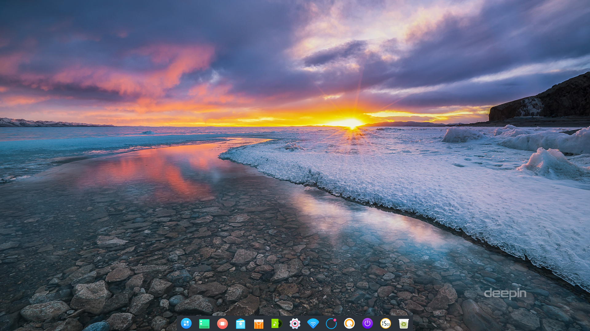
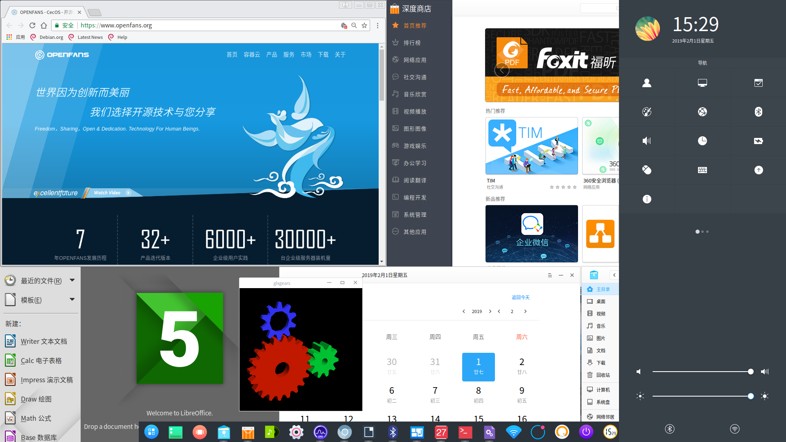
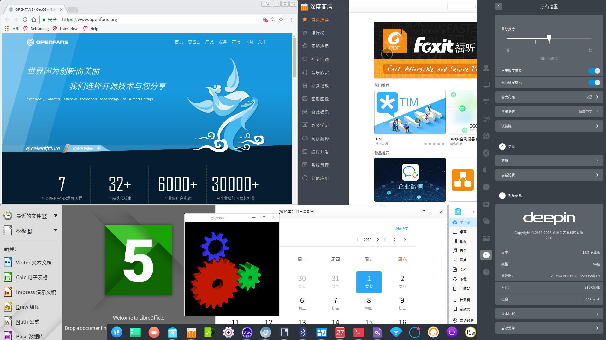
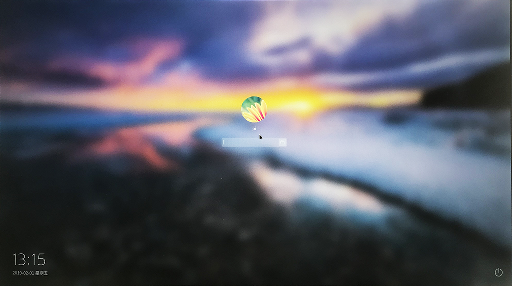
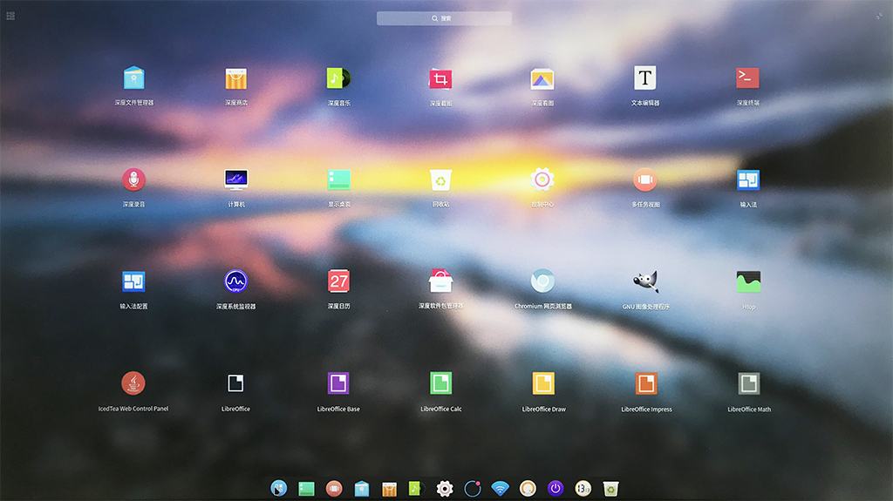
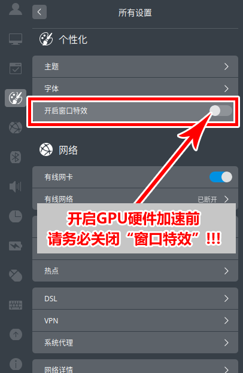
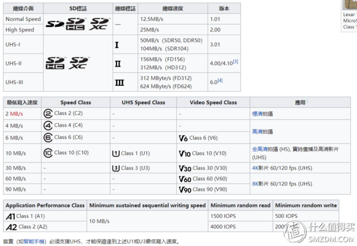

# 深度桌面 Deepin Aarch64 ARM64位 树莓派3B/3B+ 专业版

#### 再次重申！我们是团队，企业级团队出品的系统，不要拿个人作品来和我们比较。

&nbsp;&nbsp;&nbsp;&nbsp;

&nbsp;&nbsp;&nbsp;&nbsp;&nbsp;&nbsp;&nbsp;&nbsp;[OPENFANS开源社区](http://www.openfans.org)&nbsp;&nbsp;&nbsp;&nbsp;&nbsp;&nbsp;&nbsp;&nbsp;[树莓派爱好者基地](http://rpifans.cn/)&nbsp;&nbsp;&nbsp;&nbsp;&nbsp;&nbsp;&nbsp;&nbsp;&nbsp;&nbsp;&nbsp;&nbsp;**荣誉出品 - 全网首发 ！！**

----

## 系统介绍

大名鼎鼎的深度Deepin这里就不做过多介绍了，目前网上只有古老的32位树莓派2B的镜像，没有支持3B/3B+的镜像，就更别奢望Aarch64 ARM64位的树莓派3B/3B+的镜像支持了... 

现在，OPENFANS基于自己的基础系统U5版镜像，移植了完整的【 深度Deepin专业版 】桌面

目前已正式发布，并提供下载，这是目前**第一个**基于完整的*Debian Aarch64*架构而构建的适配于:

**树莓派B/3B+/3A**的**64位深度ARM64桌面系统镜像 !!**

点击 [此处](https://pan.baidu.com/s/1hyxwtWqcjaf6G7FZTjdwKg) 前往下载

# [捐赠](../donation/README.md)

----

## 系统特点

1. 完全兼容 **[OPENFANS Debian Pi Aarch64](https://github.com/openfans-community-offical/Debian-Pi-Aarch64)** 系统，具备 **OPENFANS Debian Pi Aarch64** 系统的所有优秀特性

2. 完全支持 **OPENFANS Debian Pi Aarch64** 系统的所有配置和操作指令

3. 得益于强大的 **OPENFANS Debian Pi Aarch64** 的底层支持，我们在U5版的基础系统之上对内核进行了魔改，极大的提高了内存压缩和使用效率 **[\*1]**

4. 在U5版的基础系统之上，我们从内核和驱动上强化了GPU驱动的图形性能，以满足深度重型桌面环境对图形化性能的强劲需求 **[\*2]**

5. 因为深度桌面环境属于重型桌面环境，对CPU、GPU、内存都有一定的要求，我们通过 **[\*1]**和**[\*2]** 的工作，不仅让树莓派运行ARM64位深度桌面成为可能，更具备了优秀的图形和视频处理能力，即使是谷歌浏览器这样的大型浏览器，也能轻松实现在线视频的流畅播放（点击[此处](./deepin.md#%E6%92%AD%E6%94%BE%E8%A7%86%E9%A2%91)查看播放视频的文件）

6. 和**OPENFANS Debian Pi Aarch64**一样，深度ARM64桌面系统镜像使用UEFI启动，完整支持有线、无线网卡和蓝牙设备，均可以通过图形界面配置

7. 支持 **shellinabox** Web方式进行SSH访问，使用方法同**OPENFANS Debian Pi Aarch64**一致

8. 默认使用成熟的**EXT4**文件系统

9. 同**OPENFANS Debian Pi Aarch64**共享软件源和更新

10. 支持TF卡和USB外设的多重启动模式

----

## 截图

#### 系统桌面

#### 系统面板

#### 登录窗口

#### DashBoard

- 关键硬件信息

#### 系统桌面版本

#### 播放视频

系统浏览器播放视频演示1 [下载](../videos/deep_show_1.mp4) | [在线播放](https://v.qq.com/x/page/n08348fdlcr.html)

系统浏览器播放视频演示2 [下载](../videos/deep_show_2.mp4)

----

## 系统说明

1. 系统默认没有开启root账户的登录权限

2. 不允许保持使用默认的用户密码

3. 默认系统账户名：**pi**  ，密码：**raspberry**

4. 首次登录必须修改默认的密码，总共需要输入4次密码：

      - 第一次是默认密码 **raspberry**  - *PS: 登录认证*
      - 第二次也是默认密码 **raspberry**  - *PS: 修改密码的操作认证*
      - 第三次设置新密码  - *PS: 设置密码*
      - 第四次确认新密码  - *PS: 必须和新设置的密码一致*
      - **修改密码操作请务必在完成初始安装的3次重启后再进行！**

5. 首次登录系统后，需要打开终端，执行以下命令以开启GPU硬件加速支持

        enableV3D
        
      - **注意：**

      - **开启GPU硬件加速前，请务必前往"设置界面"中的"个性化"设置，关闭"窗口特效"**

      - **如下图所示，否则会出现卡顿等问题 ！！！**

      - 

6. 首次安装系统会自动启动3次
      - 第一次检查文件系统
      - 第二次自动扩展根分区
      - 第三次自动生成Swap交换文件并初始化系统
      - **系统初始安装可能会消耗较长的时间，请耐心等待**

----

## 关于TF卡的要求

因为深度桌面属于重型桌面，对硬件要求较高，树莓派的硬件性能有限，特别是内存，我们已经通过Zswap压缩和算法调优缓解了部分内存紧张的问题，但是由于在树莓派上运行深度桌面必须开启Swap交换的支持，所以对TF卡的性能有一定的要求

### TF卡类型参照表

### TF卡的选择

- **为了良好的体验和充分满足性能的需求，建议使用【 SDHC/XC-I+A1/V30+U3 】以上的卡**

#### SDHC/XC-I+A1/V30+U3以下的卡

- 不建议使用浏览器观看视频和执行多任务

#### SDHC/XC-I+U3以下的卡

- 不建议使用浏览器观看视频和执行多任务

- 不建议开启GPU硬件加速支持 - "enableV3D"

#### U3以下的卡

- 不建议使用浏览器观看视频和执行多任务

- 不建议开启GPU硬件加速支持 - "enableV3D"

- 不建议使用谷歌浏览器

#### C10类及以下的卡

-  **不建议使用**

----

## 下载地址

点击 **[此处](https://pan.baidu.com/s/1hyxwtWqcjaf6G7FZTjdwKg)** 前往下载

## 致谢

# [捐赠](../donation/README.md)

###### *感谢 yangxuan8282(七喜/Y大) 提供的支持和帮助

