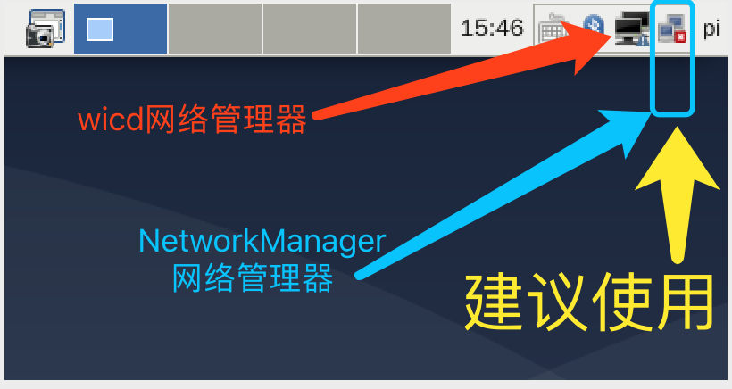
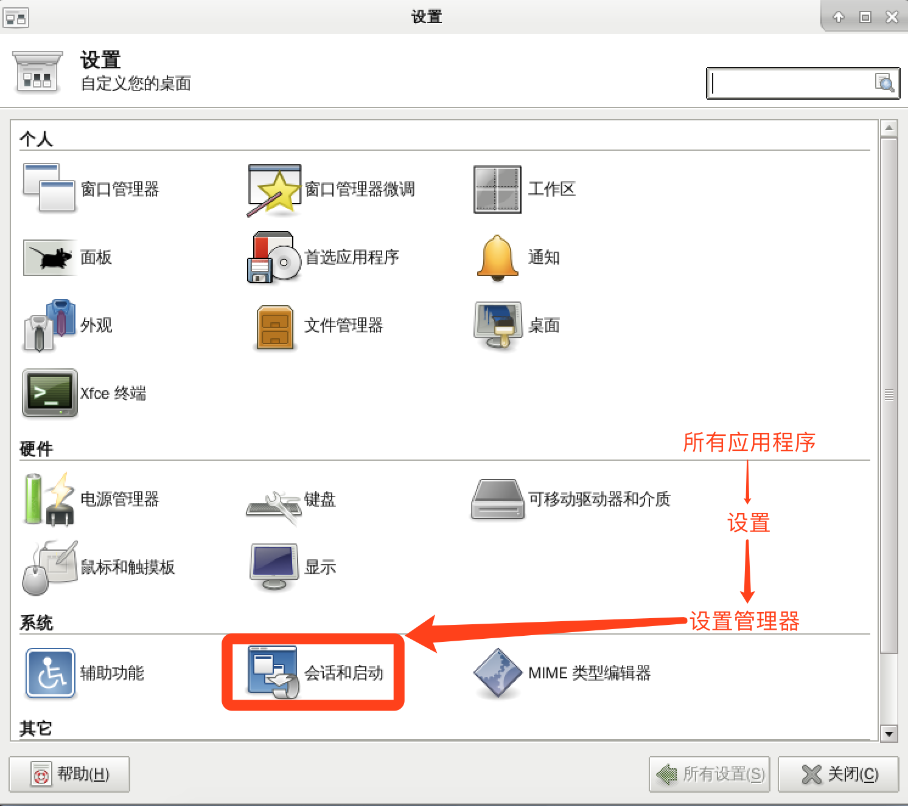
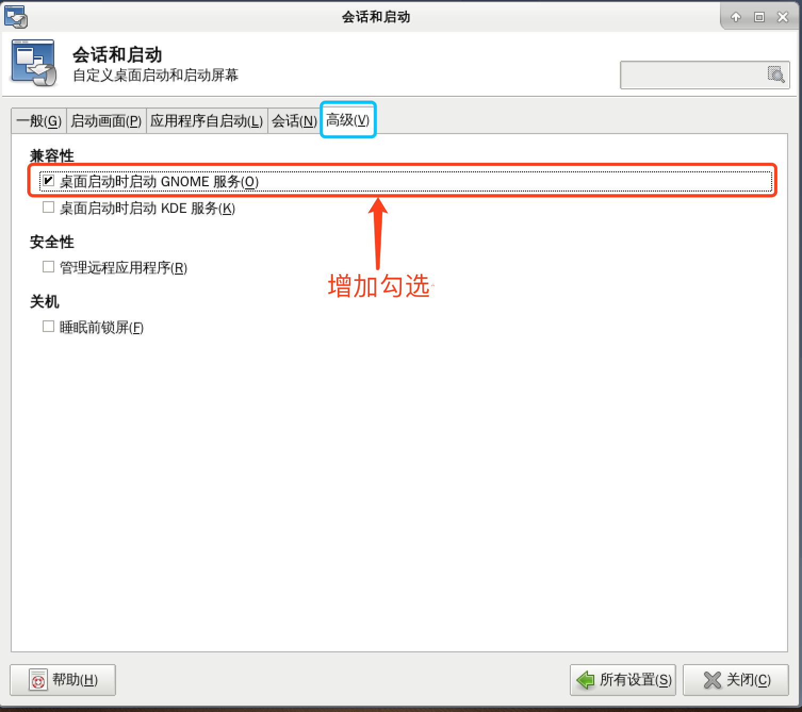

# Debian-Pi-Aarch64 Xfce桌面  Wifi无线设置

## 已知问题：

客户端兼容性问题，即使输入正确的密码也 **无法连接到无线网络**

## 问题根源：

GNOME-KEYRING未启用，必要时需要开机自动启用

## 图形化解决方案：

- 如下图所示：右上角有2个无线管理程序，从 **最右边往左** 依次是 **"NetworkManager"** 和 **"Wicd"**

为了保证无线的兼容性，所以我们集成了多个无线管理工具，这里我们强烈推荐使用 **"NetworkManager"**

- 然后我们来进行**GNOME-KEYRING**的相关设置

点击屏幕最左上方，选择 **"所有应用程序"** -> **"设置"** -> **"设置管理器"** ，

在弹出的 **"设置"** 窗口选择 **"会话和启动"** 如下图所示：

打开 **"会话和启动"** 设置后，选择 **"应用程序自启动"** 选项

取消勾选 **"Wicd Network Manager Tray"**

勾选 **"Certificate and Key Storage (GNOME Keyring: PKCS#11 Componet)"**

勾选 **"Secret Storage Service (GNOME Keyring: Secret Service)"**

如下图所示：

- 接下来在 **"会话和启动窗口"** 选择 **"高级"** 选项

在兼容性部分，勾选 **"桌面启动时启动GNOME服务"** ，如下图所示：

- 最后重启系统，然后再使用 桌面右上角的 **"NetworkManager"** 管理器连接到你的无线网络

## 终极解决办法：

直接修改无线配置文件（参考无线设置部分的说明）点击[此处](../README.md#%E7%BD%91%E7%BB%9C%E9%A2%84%E9%85%8D%E7%BD%AE)查看
